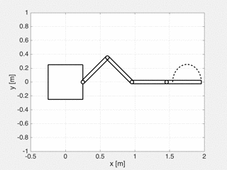

# SPART - SPAcecraft Robotics Toolkit

SPART is a MATLAB/SIMULINK open-source modeling and control toolkit for orbiting spacecraft with robotic arms (i.e floating base robots).

SPART is organized as a collection of MATLAB functions and Simulink blocks. These can be used to build plants, forward or inverse dynamic solvers and controllers.

SPART allows to compute:
* Kinematic - rotation matrices, position vectors and homogeneous transformation matrices.
* Differential kinematics - Jacobians and operational space velocities.
* Dynamic magnitudes - Generalized inertia and convective inertia matrices.
* Solving the forward dynamics (including the floating base case).
* Solving the inverse dynamics.

Additionally SPART supports:
* Symbolic computation of all the magnitudes.
* Automatic Code Generation support.
	* Code can be integrated in Simulink models.
	* Efficient C/C++ code can be automatically generated.

Here is an example of a plannar Desired-Reaction-Maneuver, where the kinematic redundancy of a manipulator is used to make floating base point to the end-effector while this one is moving along a prescribed path.

-><-

## Installation

Just clone or download the toolkit and in Matlab run the `SPART2path` script. This will add all the SPART functions and Simulink library to the path and save it. Then you can use it as any other MATLAB toolbox.

## Usage

An [extensive documentation](http://spart.readthedocs.org) is available, including a [Tutorial](http://spart.readthedocs.io/en/latest/Tutorial.html).

Additionally, some usage examples, illustrating the basic functionality of the toolkit, can be found in the `Examples` folder.

## License

This software is released under the GPLv3 license.

## Contributors

The software has been developed at the Spacecraft Robotics Laboratory at the Naval Postgraduate School (Monterey, CA).

A list of contributors can be found [here](contributors.md).

